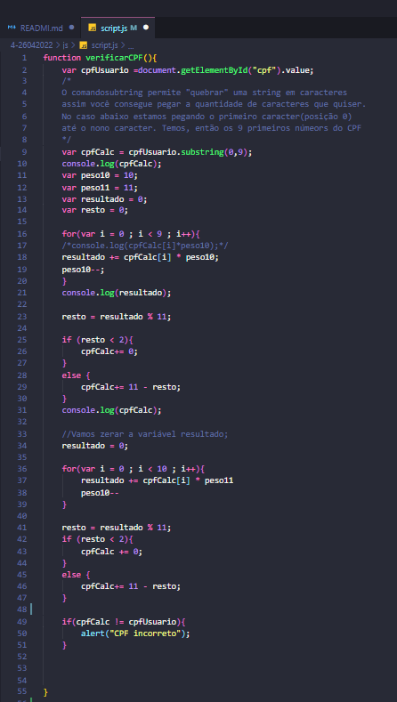

# Estudo Javascript
## Trabalhando com a estrutura básica do Javascript


---
### Sumário
        * introdução ao Javascript
        * Elementos da introdução 
            -Criação de variáveis
            -Criação de constantes
        * Forma de utilização do html

```javascript
 <script>alert("olá Mundo!");</script>   
 ```

 Outro exemplo de aplicação do JavaScript 
 ```html
 <html>
     <head>
         <title>Exemplo<title>

     </head>
    <body> 
        <script>
            console.log("olá MUndo");
        </script>
    </body>
 </html>   
 ```
 #### Cálculo do CPF em Javascript
 